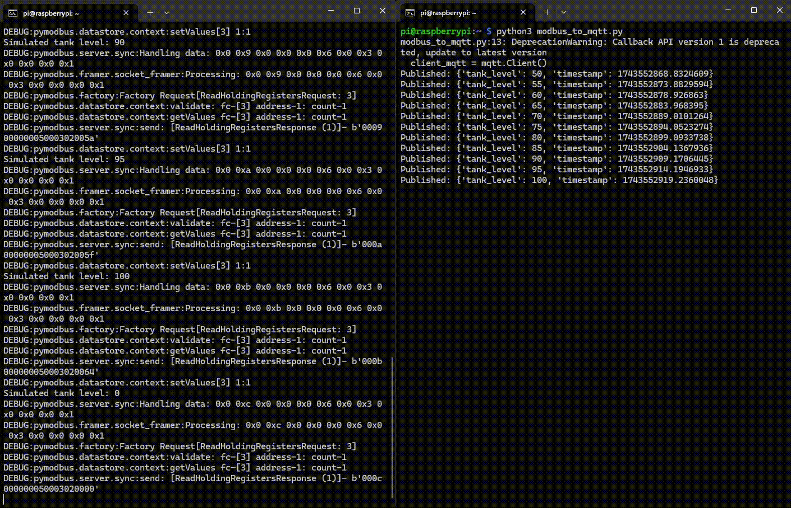

# 🛢️ Modbus to MQTT Tank Simulation – Raspberry Pi Zero Project

This project simulates a smart industrial tank control system using a Raspberry Pi Zero. It mimics a PLC (Modbus TCP) generating real-time tank level data, which is then sent via MQTT and visualized using Node-RED.

## 📦 Project Components

| File | Description |
|------|-------------|
| `modbus_slave.py` | Simulates a tank process with a Modbus TCP server (tank fills from 0 to 100 and resets) |
| `modbus_to_mqtt.py` | Reads Modbus register and publishes tank level as JSON via MQTT |
| `.gitignore` | Prevents committing unnecessary files like `.vscode/` and Python caches |

---

## 🔧 How It Works

1. A simulated Modbus server increments a tank level from 0 to 100 every 5 seconds.
2. A Python script reads the value from Modbus register `0` and publishes it to:
   ```
   factory/tank
   ```
   via `test.mosquitto.org`.
3. Node-RED reads the MQTT topic and shows a:
   - 📊 **Gauge** for real-time tank level
   - 📈 **Chart** for live historical trend

---

## 💻 Getting Started

### ✅ 1. Clone the Project

```bash
git clone https://github.com/shamim-sulaiman/modbus-mqtt-pi-gateway.git
cd modbus-mqtt-pi-gateway
```

### ✅ 2. Install Python Dependencies

```bash
sudo apt update
sudo apt install python3-pip
pip3 install pymodbus paho-mqtt typing-extensions
```

### ✅ 3. Run the Modbus Server

```bash
python3 modbus_slave.py
```

### ✅ 4. Run the MQTT Publisher

In another terminal:

```bash
python3 modbus_to_mqtt.py
```

---

## 📡 Node-RED Dashboard Setup (Optional but Recommended)

### 🔸 Install Node-RED (with Node.js 18)

```bash
bash <(curl -sL https://raw.githubusercontent.com/node-red/linux-installers/master/deb/update-nodejs-and-nodered) --node18
```

When asked:
- ✅ Allow external modules: Yes
- ✅ Install Pi-specific nodes: Yes

### 🔸 Allow Remote Access

Edit the settings file:

```bash
nano ~/.node-red/settings.js
```

Change:

```js
uiHost: "0.0.0.0", 
```

Restart Node-RED:

```bash
node-red-stop
node-red-start
```

### 🔸 Access Node-RED UI

From your browser (same network):

```
http://<your-pi-ip>:1880
```

### 🔸 Install Nodes (in Node-RED Editor)
- Go to Menu > Manage Palette > Install:
  - `node-red-dashboard`
  - `node-red-node-mqtt`

### 🔸 Build Flow

| Node         | Config                                   |
|--------------|-------------------------------------------|
| MQTT IN      | Topic: `factory/tank` <br> Broker: `test.mosquitto.org:1883` |
| Function     | `msg.payload = msg.payload.tank_level; return msg;` |
| Gauge        | Tank Level (0–100%)                      |
| Chart        | Y-axis 0–100, 1-min window                |

✅ Deploy your flow  
🌐 View at: `http://<your-pi-ip>:1880/ui`

---

## 📸 Preview

### ▶️ Running `modbus_slave.py` (left) and `modbus_to_mqtt.py` (right)
<p align="center">
  
</p>

### 🖥️ Node-RED Dashboard in Action
<p align="center">
  
</p>

---

## 📌 Future Enhancements

- Add reset button to control tank via MQTT
- Alarm node when tank > 80%
- Log to CSV or cloud DB
- Deploy with Docker on more powerful device

---

## 🔗 Credits

Created by [@ShamimSulaiman](https://shamimsulaiman.com)  
Inspired by real-world PLC + SCADA integration work