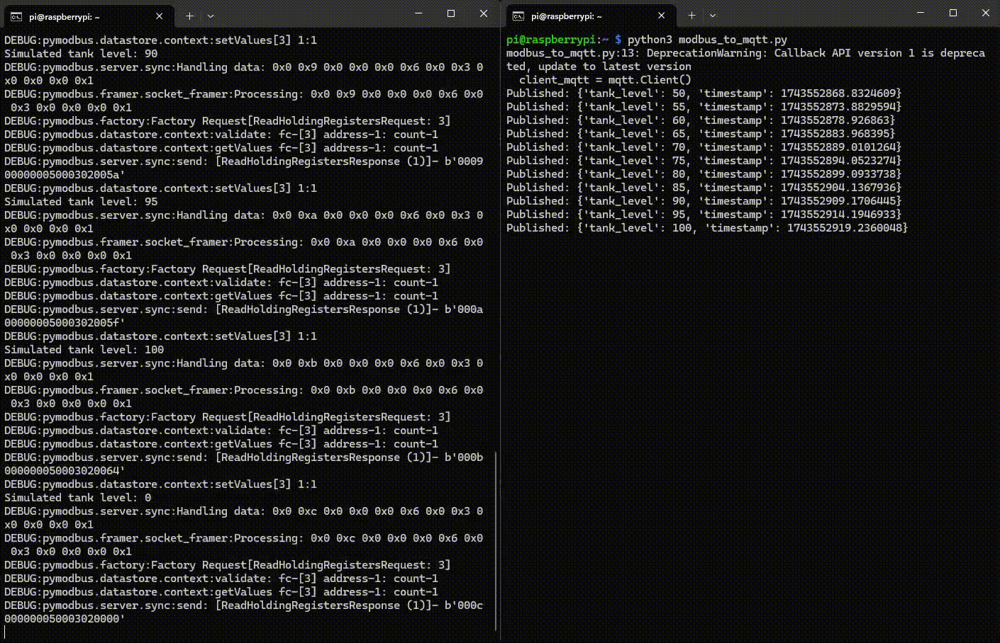
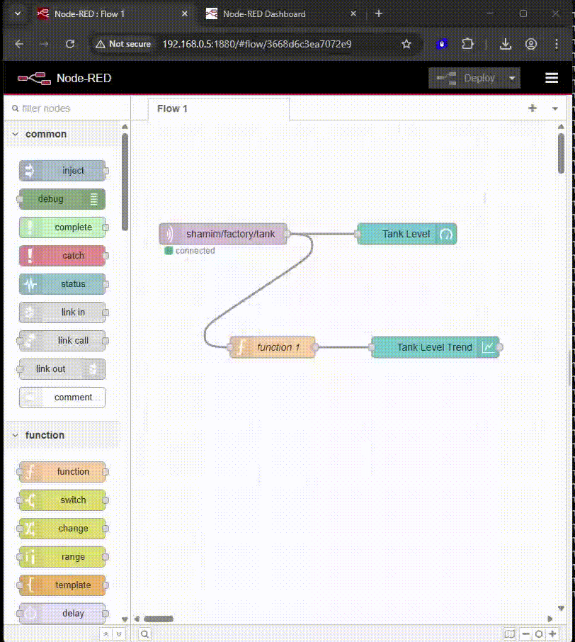

# Modbus to MQTT Tank Simulation – Raspberry Pi Zero Project

This project simulates a smart industrial tank control system using a Raspberry Pi Zero. It mimics a PLC (Modbus TCP) generating real-time tank level data, which is then sent via MQTT and visualized using Node-RED.

## Project Components

| File | Description |
|------|-------------|
| `modbus_slave.py` | Simulates a tank process with a Modbus TCP server (tank fills from 0 to 100 and resets) |
| `modbus_to_mqtt.py` | Reads Modbus register and publishes tank level as JSON via MQTT |
| `.gitignore` | Prevents committing unnecessary files like `.vscode/` and Python caches |

## How It Works

### 1. Modbus Server Simulation (`modbus_slave.py`)

- A Python script uses `pymodbus` to create a Modbus TCP server, simulating a PLC.
- It continuously updates holding register `0` with a tank level that increases every 5 seconds (from 0 to 100), then resets.
- In a real setup, this register can be populated with actual sensor readings via GPIO, I2C, or ADC.

### 2. Modbus to MQTT Gateway (`modbus_to_mqtt.py`)

- A second Python script acts as an edge device.
- It reads the value from holding register `0` over Modbus TCP.
- The data is formatted into JSON and published to the MQTT topic `/factory/tank` using the broker `test.mosquitto.org`.

Example payload:

    {
      "tank_level": 75,
      "timestamp": 1743543000
    }

### 3. Real-Time Dashboard via Node-RED

- Node-RED subscribes to the MQTT topic `shamim/factory/tank`.
- It displays the tank level using:
  - A gauge (for current value)
  - A line chart (for trend history)
- The dashboard is available at: `http://<your-pi-ip>:1880/ui`

### 4. Real Data Integration (Optional)

To use actual sensor data:

- Replace the tank simulation logic in `modbus_slave.py` with sensor input from:
  - GPIO-based digital sensors (e.g. float switch)
  - Analog sensors via ADC (e.g. MCP3008, HX711)
  - I2C/SPI sensors (e.g. ultrasonic, pressure)
- Or, skip the simulator and read directly from a real PLC using `modbus_to_mqtt.py` as a Modbus TCP or RTU client.

---

## Getting Started

### 1. Clone the Project

```bash
git clone https://github.com/shamim-sulaiman/modbus-mqtt-pi-gateway.git
cd modbus-mqtt-pi-gateway
```

### 2. Install Python Dependencies

```bash
sudo apt update
sudo apt install python3-pip
pip3 install pymodbus paho-mqtt typing-extensions
```

### 3. Run the Modbus Server

```bash
python3 modbus_slave.py
```

### 4. Run the MQTT Publisher

In another terminal:

```bash
python3 modbus_to_mqtt.py
```

## Node-RED Dashboard Setup (Optional but Recommended)

### 1. Install Node-RED (with Node.js 18)

```bash
bash <(curl -sL https://raw.githubusercontent.com/node-red/linux-installers/master/deb/update-nodejs-and-nodered) --node18
```

When asked:
- Allow external modules: Yes
- Install Pi-specific nodes: Yes

### 2. Allow Remote Access

Edit the settings file:

```bash
nano ~/.node-red/settings.js
```

Change:

```js
uiHost: "0.0.0.0", 
```

Restart Node-RED:

```bash
node-red-stop
node-red-start
```

### 3. Access Node-RED UI

From your browser (same network):

```
http://<your-pi-ip>:1880
```

### 4. Install Nodes (in Node-RED Editor)
- Go to Menu > Manage Palette > Install:
  - `node-red-dashboard`
  - `node-red-node-mqtt`

### 5. Build Flow

| Node         | Config                                   |
|--------------|-------------------------------------------|
| MQTT IN      | Topic: `factory/tank` <br> Broker: `test.mosquitto.org:1883` |
| Function     | `msg.payload = msg.payload.tank_level; return msg;` |
| Gauge        | Tank Level (0–100%)                      |
| Chart        | Y-axis 0–100, 1-min window                |

Deploy your flow and view the dashboard live at: `http://<your-pi-ip>:1880/ui`

---

## Preview

### Running `modbus_slave.py` (left) and `modbus_to_mqtt.py` (right)
<p align="center">
  
</p>

### Node-RED Dashboard in Action
<p align="center">
  
</p>

## Improvement

- Add reset button to control tank via MQTT
- Alarm node when tank > 80%
- Log to CSV or cloud DB
- Deploy with Docker on more powerful device
